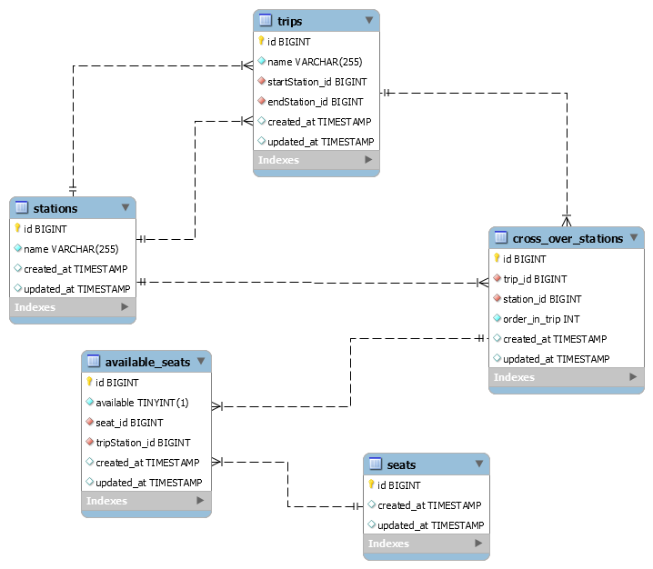

[](https://robustastudio.com/)  


# Fleet Management System

This repository is for Robusta Studio's task building a fleet management (bus booking) system.  

## Built with

Stack | Technology used
----- | ---------------
Programming Language | PHP
Web Framework | [Laravel 8](https://laravel.com/docs/8.x)
Relational Database | MySQL

## Prerequisities

This project leverages the power of [Laravel Sail](https://laravel.com/docs/8.x/sail) which, at its heart, is a `docker-compose.yml` file.  
So, in order to get the project up and running you just need **Docker** installed on your PC.  
Please follow the installation documentation based on your operating system whether [macOS](https://laravel.com/docs/8.x/installation#getting-started-on-macos), [Windows](https://laravel.com/docs/8.x/installation#getting-started-on-windows), or [Linux](https://laravel.com/docs/8.x/installation#getting-started-on-linux).  

## Installation & Setup

After you have installed Docker on your machine follow these steps to get the project up and running:  
1. Clone the repository to your machine 
    ```
    git clone https://github.com/marwanatef2/Robusta-task.git  

    cd Robusta-task
    ```

2. Install project dependencies
    ```
    docker run --rm \
    -u "$(id -u):$(id -g)" \
    -v $(pwd):/opt \
    -w /opt \
    laravelsail/php80-composer:latest \
    composer install --ignore-platform-reqs
    ```

3. Configure a bash alias
    ```
    alias sail='bash vendor/bin/sail'
    ```

4. Build and Run the project (Docker images & containers), this step might take some time for the first time.
    ```
    sail up -d
    ```
    > Notice that the `-d` runs the project in detached mode.

5. Once the last step is done you can migrate & seed the database with the Database dump
    ```
    sail artisan migrate --seed
    ```
    If after some changes to the projects database you wish to reset those changes run this command
    ```
    sail artisan migrate:fresh --seed
    ```

6. Go to http://localhost/api/trips and you will get a list of all trips with sorted lists of stations represeting the path of the trip.
    >Try this from either [Postman](https://www.postman.com/downloads/) or a browser that has [JsonView](https://chrome.google.com/webstore/detail/jsonview/chklaanhfefbnpoihckbnefhakgolnmc?hl=en) extension installed to have the returned list of trips prettied.  
    
7. And that's it, the project is up and running :rocket:

## API Endpoints

All API endpoints are prefixed with `/api`  

Endpoint | Method | Body | Query Params | Description
-------- | ------ | ---- | ------------ | -----------
/trips | `GET` | - | - | Gets all trips  
/trips | `POST` | `{stations: [] }` | - | Add a new trip with list of stations  
/seats | `GET` | - | `start : string` - `end : string` | Get all available seats at all trips crossing by start & end stations  
/seats | `POST` | `{seat_id, trip_id}` | `start : string` - `end : string` | Book a seat at a specific trip from start station to end station  

### Playing around

Begin with getting all trips to see which stations the cross by and each trip id by hitting http://localhost/api/trips, if you followed the steps above to seed data in your projects database you should see something like this
```javascript
[
    {
        "name": "Cairo-Aswan",
        "total_stations": 9,
        "stations": [
            {
                "name": "Cairo"
            },
            {
                "name": "Fayum"
            },
            .
            .
            .
            {
                "name": "Luxor"
            },
            {
                "name": "Aswan"
            }
        ]
    },
    {
        "name": "Matrouh-Cairo",
        "total_stations": 8,
        "stations": [
            {
                "name": "Matrouh"
            },
            {
                "name": "Alexandria"
            },
            .
            .
            .
            {
                "name": "Giza"
            },
            {
                "name": "Cairo"
            }
        ]
    },
    .
    .
    .
]
```

Pick any two stations and start playing around
> Notice the `status_code` of the response; `404` if no results found with an error message, `201` if a seat is booked successfully, etc.  

If you tried http://localhost/api/seats?start=Matrouh&end=Cairo you should get a list of seats on all possible trips that goes from *Matrouh* to *Cairo* as follow
```javascript
[
    {
        "trip": {
            "id": 2,
            "name": "Matrouh-Cairo"
        },
        "number_of_avaialable_seats": 12,
        "available_seats": [
            1,
            2,
            3,
            4,
            5,
            6,
            7,
            8,
            9,
            10,
            11,
            12
        ]
    },
    {
        "trip": {
            "id": 3,
            "name": "Matrouh-Beni Suef"
        },
        "number_of_avaialable_seats": 12,
        "available_seats": [
            1,
            2,
            3,
            4,
            5,
            6,
            7,
            8,
            9,
            10,
            11,
            12
        ]
    }
]
```

> Notice that each trip start with all **12** seats available

For example, *Hurghada* is not seeded to the database so if you tried http://localhost/api/seats?start=Cairo&end=Hurghada you should get a `404` response with the following message 
```javascript
{
    "message": "No station match end station 'Hurghada'"
}
```  
Start booking seats at specific trips to consume them and check if they reflect back in the seats endpoint.

## Development 

The project structure follows the [Laravel 8 project directory](https://laravel.com/docs/8.x/structure) but many files are not used, *haven't removed them in order not to mess with anything*.  
Nevertheless, the main project files can be found here:
* [API Endpoints](https://github.com/marwanatef2/Robusta-task/blob/master/routes/api.php)  
* Business Logic  
    * [Trips Controller](https://github.com/marwanatef2/Robusta-task/blob/master/app/Http/Controllers/TripsController.php)
    * [Seats Controller](https://github.com/marwanatef2/Robusta-task/blob/master/app/Http/Controllers/SeatsController.php)
* Application [Models](https://github.com/marwanatef2/Robusta-task/tree/master/app/Models)
* Database  
    * [Migrations](https://github.com/marwanatef2/Robusta-task/tree/master/database/migrations)
    * [Seeders](https://github.com/marwanatef2/Robusta-task/tree/master/database/seeders)  

### EER Diagram


### Assumptions

Some assumptions were made just for simplification but not implemented as
* Each trip has a specific date & time, Or
* We're returning all trips at specific date & time  

Yes, that was it, thank you for reaching this point :pray:
